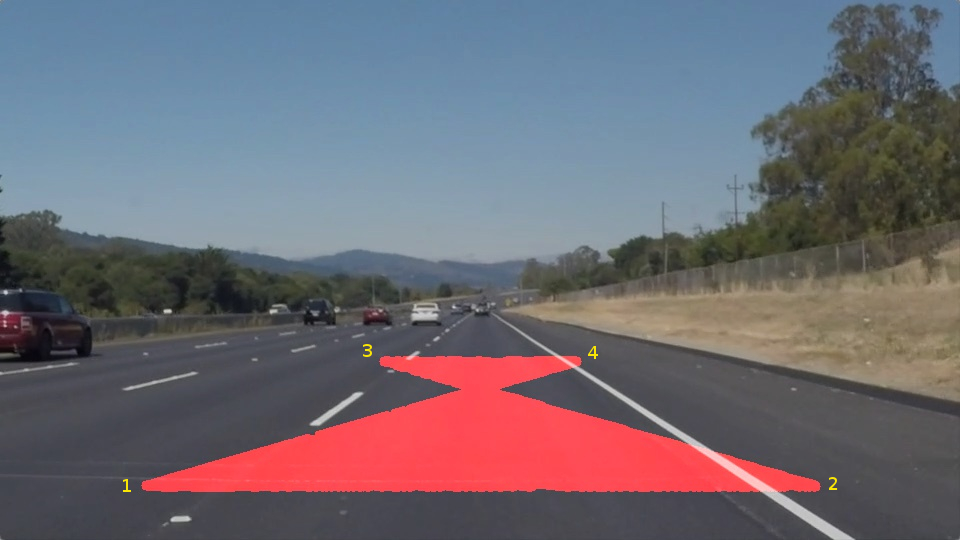
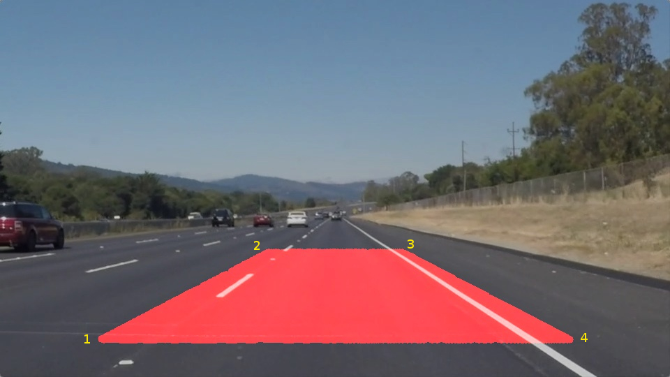

# Udacity Project 1
## Finding Lane Lines on the Road

### Background
This is the first project for Udacity's Self-driving Car Engineering Program.
This project aims to create an algorithm that detects lane lines on the road. Three videos taken by a camera mounted on the front of a moving car are provided:

- solidWhiteRight.mp4
- solidYellowLeft.mp4 
- challenge.mp4

The detected lane lines in the video shall be annotated using a red line overimposed on the lane lines.

### Pipeline Summary
To create the algorithm, image processing techniques were used. The pipeline is tested first on an image where lane lines are detected and annotated. Then, the videos were processed frame by frame by applying the pipeline on each video frame (as was done in an image). The pipeline can be summarized in the following steps.

1. Blur image to smooth out noise but retain edges
2. Detect edges
3. Mask edges to neglect unwanted lines
4. Detect lines
5. Segregate lines belonging to the left lane and right lane
6. Save x's and y's for each lane in a buffer array
7. Extrapolate line 
8. Draw extrapolated line as annotation
9. Merge annotation to original video frame and output as the annotated version of the video.

### Code

This algorithm requires python 3.5 and imports the following packages:
- [NumPy](http://www.numpy.org/)
- [math](https://docs.python.org/3/library/math.html)
- [sys](https://docs.python.org/3/library/sys.html)
- [os](https://docs.python.org/3/library/os.html)
- [opencv](http://opencv.org/)
- [moviepy](http://zulko.github.io/moviepy/)
- [matplotlib](http://matplotlib.org/)

### Pipeline Details

#### Step 1. Image Smoothing
In this project, image conversion to grayscale was not done. This decision has been made after encountering difficulties in detecting yellow lanes especially in the challenge video since the yellow lane would just blend with the road in grayscale mode. Instead, RGB image is directly processed. To enhace the detection of lane edges, the image is blurred using the [bilateral filter](http://docs.opencv.org/2.4/doc/tutorials/imgproc/gausian_median_blur_bilateral_filter/gausian_median_blur_bilateral_filter.html). This method is used instead of the gaussian filter as it is better in preserving the edges while smoothing out the noises. Through various trials and testing the following parameter values were observed to give the best results.

    d = 5             # Diameter of each pixel neighborhood that is used during filtering
    sigmaColor = 100  # pixel distance in color space that will be mixed together
    sigmaSpace = 100  # pixel distance in coordinate space that will affect each other
   
#### Step 2. Edge Detection
After image smoothing, the Canny edge detection is used to detect the edges. Upon series of experimentations, the following parameter values are chosen: 
    
    low_threshold = 100
    high_threshold = 200

#### Step 3. Edge Masking
To eliminate the unwanted edges, the image is masked except a region of interest defined by a polygon. In this step, it is crucial to define the vertices of the polygon at the proper coordinates in the image to avoid masking the region of interest which would significantly decrease the number of detected lane edges. The order of the vertices as they are written in the code matters and putting them in incorrect order would create a different polygon than what is intended as shown in the image below. In this case, the intended polygon is a trapezoid such that the points on the lane that intersects with the red area will be detected. However, as shown below, the mask actually neglected several points on the lane which would create problems later in the line extrapolation. Such error was created by writing the vertices in the order indicated by the number annotations.

It is suggested to write the vertices in clockwise order (or counter-clockwise if preferred) going through the corners of the polygon. To make the algorithm adaptable to other image sizes the vertices are defined as a percentage of the image shape. The correct trapezoidal polygon is shown below with number annotations depicting the order of writing the vertex.

To display the mask as guide in defining the coordinates of the vertices during trials, the "region_of_interest()" function should be edited to return the mask instead of the masked_image. 

#### Step. 4 Line Detection
The Hough function is used to detect the lines and through several trials, the following parameter values are found to perform better.

    rho = 1               # distance resolution in pixels of the Hough grid
    theta = np.pi/180     # angular resolution in radians of the Hough grid
    threshold = 7         # minimum number of votes (intersections in Hough grid cell)
    min_line_len = 15     # minimum number of pixels making up a line
    max_line_gap = 3      # maximum gap in pixels between connectable line segments

#### Step 5. Line Segregation
The line segregation, data buffering, and line extrapolation is done within the "draw_lines()" function. 
Prior to these steps, the slope of the lines detected by Hough function were derived by the following equation.

    slope = (y2-y1)/(x2-x1) * (180 / np.pi)   # converted to degree units

The lines with least probable slopes, i.e., close to the horizontal line, where filtered out. This is to neglect the edges corresponding to shadows and road quality changes which are usually horizontal. Through several trials, the slopes being neglected are chosen to be between -30 degrees and +30 degrees. 

Some of the remaining lines have approximately the same slopes yet are located in the opposite sides of the image. This situation makes the segregation based on the slope value confusing and unreliable. Hence, the segregation is done based on the x coordinate. The image is divided (verically) into two halves, X's (with corresponding Y's) from 0 to 0.5 of the image width belong to the left lane while the X's located at the right side, i.e., beyond 0.5 of the image width, are classified as part of the right lane.  

#### Step 6. Data Buffering
The segregated X's and Y's are stored in a buffer array (a global variable) with a length of 100.  When the buffer array gets full, the oldest data are overwritten with the newest data. Based on experimentation, there are approximately 10 to 30 (x,y) pairs for each lane that are detected in each video frame, hence, the buffer array aggregates 3 to 10 video frames.  Through this data aggregation the lane approximation becomes more stable as the data from previous video frames help in calculating the location of the lane lines in the currently processed video frame. This is based on the premise that the lanes' location and slope would not abruptly change. This method is helpful in cases when there are too few or no lines are detected in a video frame. It also helps in normalizing the image noises present in one of the video frames, making it more tolerant to the X's and Y's which are not on the lane.

It is important to note though that if the buffer array is increased further it would make the lane approximation too "stiff" and would not respond to the changes in lane direction, specifically in going through a curve. Meanwhile, if the buffer size is decreased, the lane approximation gets too "sensitive" that it tends to shake and get agitated even to small amount of image noises. Based on several trials, a size of 100 is just right to make a good compromise between sensitivity and stability. 

#### Step 7. Line Extrapolation
The data (X's and Y's) collected in the buffer arrays are used in line approximation using [numpy.polyfit](https://docs.scipy.org/doc/numpy/reference/generated/numpy.polyfit.html). In this application, the range of the Y is already known and chosen to be from 63% to 100% of the image height. The unknown values then are the X's. To determine the values of the X's, I interchanged the X and Y argument in the numpy.polyfit function since I am looking for the X's. The output of the polyfit function is an array of weights to be used to aproximate the X value for a given Y value (i.e., X = f(Y)). Then I generated a linear array of Y values ranging from 63% to 100% of the image height. The corresponding X values are determined using another function, [numpy.poly1d](https://docs.scipy.org/doc/numpy/reference/generated/numpy.poly1d.html#numpy.poly1d), which uses the previously derived weights. The process creates a pair of arrays (for x coordinates and corresponding y coordinates) which are used in drawing the left and right lanes. The following code (for the left lane) summarizes this process.

    w1 = np.polyfit((y_leftLane), (x_leftLane), 1)
    y_series = np.linspace(imshape[0]*0.63, imshape[0], imshape[0]*0.4)
    fcn = np.poly1d(w1)
    x_series = fcn(y_series)
   

#### Step 8. Drawing the Extrapolated Lines
To draw the extrapolated line, I used the opencv2 function cv2.line((x1,y1),(x2,y2), color, thickness), where points (x1,y1) and (x2,y2) are adjacent data in the X and Y series created in the previous step (i.e., Line Extrapolation). Here is the code for drawing the series of lines.

     for i in range(1,len(y_series)):
        cv2.line(img,(int(x_series[i-1]),int(y_series[i-1])),(int(x_series[i]),int(y_series[i])), color, thickness)

#### Step 9. Merge annotation to original image
Finally, the annotations (i.e., lines) are merged with the original image or video frame and reconstructed as the annotated videos. To make the drawn lines semi-transparrent I used the weighted_image() function which was given with the original files of this project. The annotated videos are named as follows in this repository:

- white.mp4
- yellow.mp4
- extra.mp4

The ipython notebook is also available, named as P1.ipynb.

---

### Algorithm Limitations
This algorithm successfully detects the lane lines in the given videos including the challenge video. However, the line segregation is based on the assumption that the left and right lanes are approximately located at the left and right side of the video frame respectively which is only true if the vehicle (or the camera) is located somewhere in the middle of the road lanes. In situations that this assumption is false, the algorithm would probably fail to segregate the detected lines properly. If line segregation fails, the lane approximation would also fail. For example, it is yet unknown how the algorithm would perform when the car meets a street intersection. 

Another limitation of this algorithm is that it only annotates straight lines, in fact, this is the reason that the annotation is shortened since it would overshoot in the curved lanes like in the challenge video.

### Room for improvements
To make the algorithm better, more stable, and generic, there should be a better way of segregating the lane lines and employ some other techniques of image pre-processing to enhance the detection of the edges. I am thinking of trying the method proposed by some colleagues in Github and Slack which is warping the image to create a "birds-eye-view" of the road. Then, different filters shall be used to detect lanes of different colors. They also use a different approach of segregating the lines into left and right lanes which is by dividing the image horizontally into several strips. They derive the histogram of the detected X's on each strip and use the top 2 as the location of the left and right lanes. I think this is a better way of line segregation. Their implementation was published for the 4th project of this program and it looks so cool. I am excited to improve this code and create something as fascinating as they did.

Another room for improvement is to use curve annotations that follow the curvature of the lane lines. Further experimentation and tweaking with the data and the 2nd degree of the numpy.polyfit() function would be a good point to start.

Lastly, it would be nice to make the algorithm know how to detect the edge of the road. This is useful in actual driving scenario when the roads has no lane lines painted on, e.g., in rural dirt roads. I am planning to use this algorithm in detecting the road edges and the lane lines here in my country, the Philippines, which is known to be one of the countries with worst traffic scenarios.  

### Hurdles and Lessons Learned
*I had a lot of fun doing this project! What puzzled me out in the beginning is that I detect too few edges. I traced the problem, trying to find out if there is something wrong with how I use the bilateral filter. I displayed the output of each step of the pipeline and I discovered that I lose the detected edges after image masking. I made a mistake in writing the order of the vertices of the polygon mask. I found out that the sequence of the vertices is crucial in creating the intended shape of the polygon. Displaying the mask helped a lot to see where the mask actualy lies on the image and on the video.*
*It is difficult to detect some colors if an image is converted to grayscale. This was observed in the challenge video when there was a portion of the road where the yellow lane would just "disappear" in grayscale. Trying to detect the yellow lane in a colored image gave a hint that it is the way to go. This also led to finding a better smoothing technique. After searching through the opencv documentation about smoothing images, I settled on used bilateral filter instead of the gausian filter. Bilateral filter is better at keeping the edges while smoothing out the noises and it gives a parameter on how distant in the color space should the pixels be for them to be combined. However, bilateral filtering increases the data processing time.*
*Before using the numpy.polyfit function, I manually get the mean of X's and Y's so I can get a reference point on the lane. To extrapolate the line, I derive two points from the reference point. The two points for X are derived by adding and subtracting the standard deviation from the reference X.*
    
    x1 = x_mean + x_std
    x2 = x_mean - x_std

Similar method is used for the Y's:
    
    y1 = y_mean + y_std
    y2 = y_mean - y_std
    
Then, I would use the opencv function to draw the extrapolated line:

    cv2.line(img,(int(x1),int(y1)),(int(x2),int(y2)), color, thickness)

However, this method requires more lines of code and is only limited to straight lines. So I had decided to use the numpy.polyfit function which can extrapolate into several polynomial degree. I did try the second degree approximation but somehow it makes the annotation lines too "snaky". Hence, in the end, I still settled on the linear approximation which I think sufficient for the requirements of this project. 
I am planning to improve the codes though to make it more generic and follow a curve line. I think this would be implemented in the project 4.

